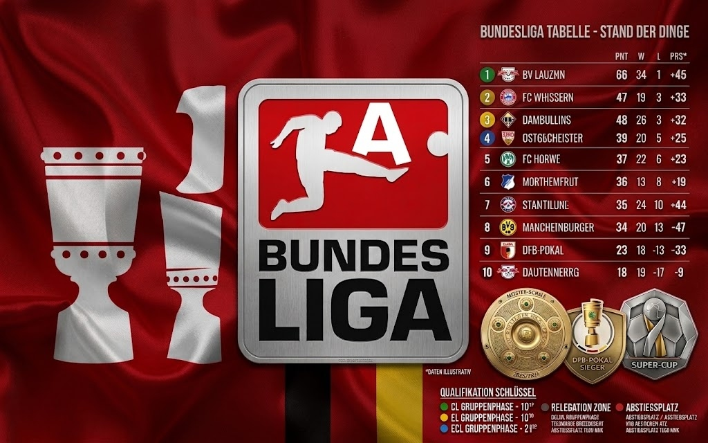
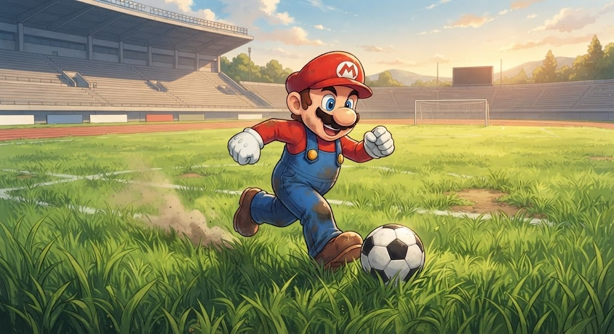

# ARENA_CORE // Global Football Platform & Tournament Simulator

> A high-performance, responsive football platform combining official competition data, live standings, match centers, media highlights, and a 10-competition Poisson mathematical tournament simulation engine.

[](https://omwe77.github.io/SIEP--arena_coore/)
[](https://github.com/omwe77/SIEP--arena_coore)

---

## 🌐 Live Demo
Experience the live application on GitHub Pages:  
👉 **[https://omwe77.github.io/SIEP--arena_coore/](https://omwe77.github.io/SIEP--arena_coore/)**

---

## 📸 Showcase & Screenshots

| Desktop Command Center | Mario Striker Header & Custom Draw |
| :---: | :---: |
|  |  |

---

## 🛠️ Tech Stack

* **Frontend Architecture**: Semantic HTML5, Vanilla CSS3 (Custom Design System & Glassmorphism), Modern Flexbox & CSS Grid.
* **Scripting & Engine**: Vanilla JavaScript (ES6+), Zero Heavy Framework Dependencies.
* **Simulation Algorithm**: Poisson Goal Distribution Model ($\lambda$ adjusted for FIFA rankings, home advantage, and attack/defense strength).
* **Automation & DevOps**: Bash Automation Script (`setup.sh`), Git Version Control, GitHub Actions / Pages.

---

## ⚡ Quick Start

Clone and run the project locally in under 30 seconds:

```bash
# 1. Clone the repository
git clone https://github.com/omwe77/SIEP--arena_coore.git

# 2. Navigate to the project directory
cd SIEP--arena_coore

# 3. Make setup script executable & run automated setup
chmod +x setup.sh
./setup.sh
```

### Running the Web App:
* **Option A**: Double-click `index.html` to open directly in any web browser.
* **Option B (Recommended Local Server)**:
  ```bash
  python3 -m http.server 8080
  # Open http://localhost:8080 in your browser
  ```

---

## 👥 Team & Roles

| Contributor | GitHub Username | Role & Responsibilities |
| :--- | :--- | :--- |
| **Om Dangol** | [@omwe77](https://github.com/omwe77) | Full-Stack Lead, Poisson Sim Engine, Custom Draw UI & Navigation |
| **Team Member** | [@np01ai4a250216](https://github.com/np01ai4a250216) | Frontend Architecture, Mario Striker Engine, Responsive Styling & QA |

---

## 🏆 Key Features

- [x] **13 Major Football Competitions**:
  - *International*: FIFA World Cup 2026, UEFA EURO 2024, Copa América.
  - *Continental*: UEFA Champions League (36-team Swiss League Phase).
  - *Domestic Leagues*: Premier League, La Liga, Serie A, Bundesliga, Ligue 1, Liga Portugal, Eredivisie, Süper Lig, Scottish Premiership.
- [x] **World Cup 48-Team Custom Draw Modal**:
  - Interactive selection of all 48 qualified nations across 6 global confederations (UEFA, CONMEBOL, CONCACAF, CAF, AFC, OFC).
  - Real 2026 confederation allocation presets & FIFA strength tiers.
- [x] **Full Knockout & Group Simulation Progression**:
  - Group Stages (Groups A–L) $\to$ Round of 32 $\to$ Round of 16 $\to$ Quarter-finals $\to$ Semi-finals $\to$ Grand Final.
- [x] **Live Match Timers & Authentic Player Scorers**:
  - Minute-by-minute live cards, authentic player goal events, extra time (AET), and penalty shootouts.
- [x] **High-Stakes Knockout UI & Celebrations**:
  - Championship crowning ceremony with confetti particle physics engine.
- [x] **Mario Striker Interactive Header**:
  - Rigged vector character running on grass turf with power shots and comic celebrations.
- [x] **Fully Responsive Design**:
  - Tested and optimized from **375px mobile** up to **1280px+ desktop** viewports.
- [x] **Zero Console Errors**:
  - 100% clean runtime lifecycle with no third-party bundle bloat.

---

## 📁 Repository Structure

```text
SIEP--arena_coore/
├── index.html                  # Semantic HTML5 root entry point
├── style.css                   # Custom CSS3 styling, responsive grid & themes
├── app.js                      # Core simulation engine & DOM controllers
├── setup.sh                    # Automated bash verification & launch script
├── data/
│   ├── real-tournaments.js     # API-Football real data cache
│   └── real-tournaments.json   # Competition metadata index
├── assets/                     # Stadium & header graphic assets
├── scratch/                    # Verification test suite & automation checks
└── README.md                   # Complete showcase documentation
```
